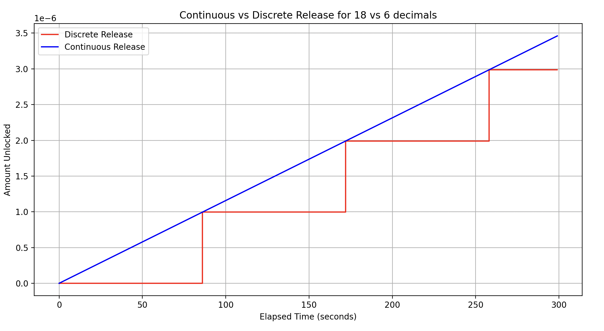
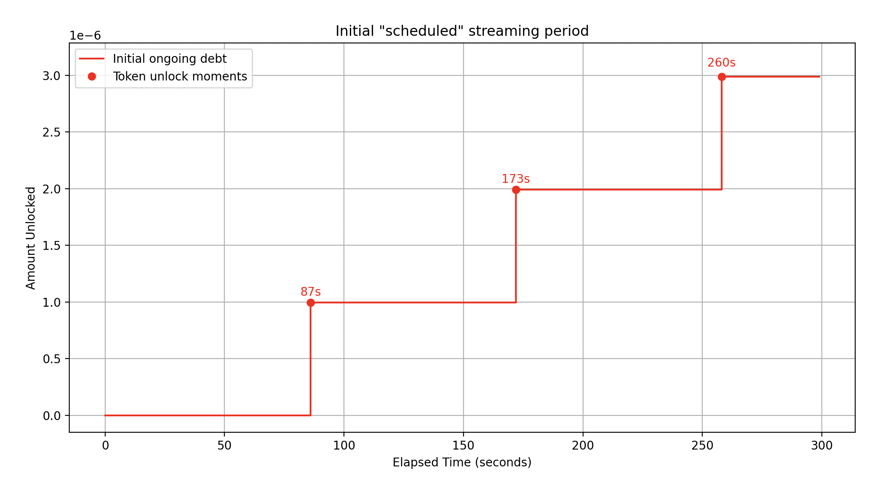
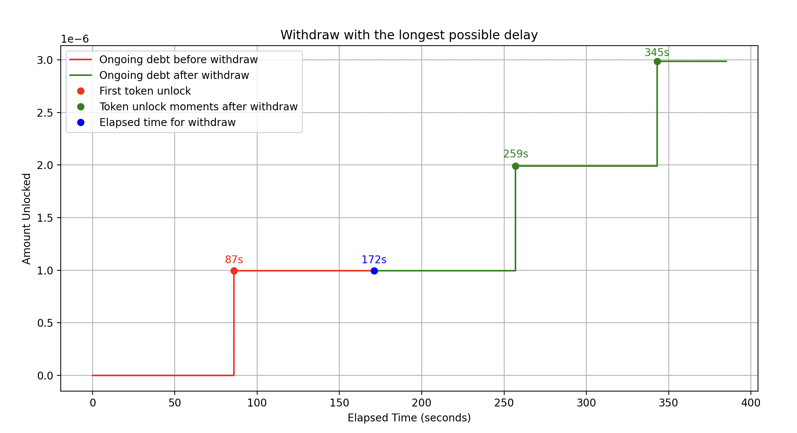

# Technical documentation

## How Flow works

One can create a flow stream without any upfront deposit, so the initial stream balance begins at zero. The sender can
later deposit any amount into the stream at any time. To improve the experience, a `createAndDeposit` function has also
been implemented to allow both create and deposit in a single transaction.

One can also start a stream without setting an rps. If rps is set to non-zero at the beginning, it begins streaming as
soon as the transaction is confirmed on the blockchain. These streams have no end date, but it allows the sender to
pause it or void it at a later date.

A stream is represented by a struct, which can be found in
[`DataTypes.sol`](https://github.com/sablier-labs/flow/blob/ba1c9ba64907200c82ccfaeaa6ab91f6229c433d/src/types/DataTypes.sol#L41-L76).

The debt is tracked using `snapshotDebtScaled` and `snapshotTime`. At snapshot, the following events are taking place:

1. `snapshotDebtScaled` is incremented by `ongoingDebtScaled` where
   `ongoingDebtScaled = rps * (block.timestamp - snapshotTime)`.
2. `snapshotTime` is updated to `block.timestamp`.

The recipient can withdraw the streamed amount at any point. However, if there aren't sufficient funds, the recipient
can only withdraw the available balance.

## Abbreviations

| Terms                       | Abbreviations |
| --------------------------- | ------------- |
| Block Timestamp             | now           |
| Covered Debt                | cd            |
| Ongoing Debt                | od            |
| Rate per second             | rps           |
| Refundable Amount           | ra            |
| Scale Factor                | sf            |
| Snapshot Debt               | sd            |
| Snapshot Time               | st            |
| Stream Balance              | bal           |
| Time elapsed since snapshot | elt           |
| Total Debt                  | td            |
| Uncovered Debt              | ud            |

## Access Control

| Action              |         Sender         | Recipient | Operator(s) |      Unknown User      |
| ------------------- | :--------------------: | :-------: | :---------: | :--------------------: |
| AdjustRatePerSecond |           ✅           |    ❌     |     ❌      |           ❌           |
| Deposit             |           ✅           |    ✅     |     ✅      |           ✅           |
| Pause               |           ✅           |    ❌     |     ❌      |           ❌           |
| Refund              |           ✅           |    ❌     |     ❌      |           ❌           |
| Restart             |           ✅           |    ❌     |     ❌      |           ❌           |
| Transfer NFT        |           ❌           |    ✅     |     ✅      |           ❌           |
| Void                |           ✅           |    ✅     |     ✅      |           ❌           |
| Withdraw            | ✅ (only to Recipient) |    ✅     |     ✅      | ✅ (only to Recipient) |

## Invariants

1. for any stream, $st \le now$

2. for a given token:

   - $\sum$ stream balances + protocol revenue = aggregate balance
   - token.balanceOf(SablierFlow) $`\ge \sum`$ stream balances + flow.protocolRevenue(token)
   - $\sum$ stream balances = $\sum$ deposited amount - $\sum$ refunded amount - $\sum$ withdrawn amount

3. For a given token, token.balanceOf(SablierFlow) $\ge$ flow.aggregateBalance(token)

4. snapshot time should never decrease

5. for any stream, if $ud > 0 \implies cd = bal$

6. if $rps \gt 0$ and no deposits are made $\implies \frac{d(ud)}{dt} \ge 0$

7. if $rps \gt 0$, and no withdraw is made $\implies \frac{d(td)}{dt} \ge 0$

8. for any stream, sum of deposited amounts $\ge$ sum of withdrawn amounts + sum of refunded

9. sum of all deposited amounts $\ge$ sum of all withdrawn amounts + sum of all refunded

10. next stream id = current stream id + 1

11. if $` ud = 0 \implies cd = td`$

12. $bal = ra + cd$

13. for any non-voided stream, if $rps \gt 0 \implies isPaused = false$ and Flow.Status is either STREAMING_SOLVENT or
    STREAMING_INSOLVENT.

14. for any non-voided stream, if $rps = 0 \implies isPaused = true$ and Flow.Status is either PAUSED_SOLVENT or
    PAUSED_INSOLVENT.

15. if $isPaused = true \implies rps = 0$

16. if $isVoided = true \implies isPaused = true$ and $ud = 0$

17. if $isVoided = false \implies \text{expected amount streamed} \ge td + \text{amount withdrawn}$ and
    $\text{expected amount streamed} - (td + \text{amount withdrawn}) \le 10$

## Limitation

- ERC-20 tokens with decimals higher than 18 are not supported.

## Core components

### 1. Ongoing debt

The ongoing debt (od) is the debt accrued since the last snapshot. It is defined as the rate per second (rps) multiplied
by the time elapsed since the snapshot time.

$od = rps \cdot elt = rps \cdot (now - st)$

### 2. Snapshot debt

The snapshot debt (sd) is the amount that the sender owed to the recipient at the snapshot time. During a snapshot, the
snapshot debt increases by the ongoing debt.

$sd = sd + od$

### 3. Total debt

The total debt (td) is the total amount the sender owes to the recipient. It is calculated as the sum of the snapshot
debt and the ongoing debt.

$td = sd + od$

### 4. Covered debt

The part of the total debt that covered by the stream balance. This is the same as the withdrawable amount, which is an
alias.

The covered debt (cd) is defined as the minimum of the total debt and the stream balance.

$`cd = \begin{cases} td & \text{if } td \le bal \\ bal & \text{if } td \gt bal \end{cases}`$

### 5. Uncovered debt

The part of the total debt that is not covered by the stream balance. This is what the sender owes to the stream.

The uncovered debt (ud) is defined as the difference between the total debt and the stream balance, applicable only when
the total debt exceeds the balance.

$`ud = \begin{cases} td - bal & \text{if } td \gt bal \\ 0 & \text{if } td \le bal \end{cases}`$

Together, covered debt and uncovered debt make up the total debt.

### 6. Refundable amount

The refundable amount (ra) is the amount that can be refunded to the sender. It is defined as the difference between the
stream balance and the total debt.

$`ra = \begin{cases} bal - td & \text{if } ud = 0 \\ 0 & \text{if } ud > 0 \end{cases}`$

## About precision

The `rps` introduces a precision problem for tokens with fewer decimals (e.g.
[USDC](https://etherscan.io/token/0xa0b86991c6218b36c1d19d4a2e9eb0ce3606eb48s), which has 6 decimals).

Let's consider an example: if a user wants to stream 10 USDC per day, the _rps_ should be

$rps = 0.000115740740740740740740...$ (infinite decimals)

But since USDC only has 6 decimals, the _rps_ would be limited to $0.000115$, leading to
$0.000115 \cdot \text{seconds in one day} = 9.936000$ USDC streamed in one day. This results in a shortfall of
$0.064000$ USDC per day, which is problematic.

## Defining rps as 18 decimal number

In the contracts, we scale the rate per second to 18 decimals. While this doesn't completely solve the issue, it
significantly minimizes it.

<a name="10-per-day-example"></a> Using the same example (streaming 10 USDC per day), if _rps_ has 18 decimals, the
end-of-day result would be:

$0.000115740740740740 \cdot \text{seconds in one day} = 9.999999999999936000$

The difference would be:

$10.000000000000000000 - 9.999999999999936000 = 0.000000000000006400$

This is an improvement by $\approx 10^{11}$. While not perfect, it is clearly much better as the recipient may have to
wait just a bit longer to receive the full 10 USDC per day. Using the 18 decimals format would delay it by just 1 more
second:

$0.000115740740740740 \cdot (\text{seconds in one day} + 1 second) = 10.000115740740677000$

Currently, it's not possible to address this precision problem entirely.

<!-- prettier-ignore -->
> [!IMPORTANT]
> The issues described in this section, as well as those discussed below,
> will not lead to a loss of funds but may affect the streaming experience for users.

### Problem 1: Relative delay

From the previous section, we can define the **Relative Delay** as the minimum period (in seconds) that a N-decimal
`rps` system would require to stream the same amount of tokens that the 18-decimal `rps` system would.

```math
\text{relative\_delay}_N = \frac{ (rps_{18} - rps_N) }{rps_N} \cdot T_{\text{interval}}
```

In a 6-decimal `rps` system, for the `rps` values provided in the example [above](#10-per-day-example), we can calculate
the relative delay over a one-day period as follows:

```math
\text{relative\_delay}_6 = \frac{ (0.000115740740740740 - 0.000115)}{0.000115} \cdot 86400 \approx 556 \, \text{seconds}
```

Similarly, relative delays for other time intervals can be calculated:

- 7 days: ~1 hour, 5 minutes
- 30 days: ~4 hours, 38 minutes
- 1 year: ~2 days, 8 hours

### Problem 2: Minimum Transferable Value

**Minimum Transferable Value (MVT)** is defined as the smallest amount of tokens that can be transferred. In an
N-decimal `rps` system, the MVT cannot be less than 1 token. For example, in case of USDC, the MVT is `0.000001e6`,
which is would to stream `0.0864e6` USDC per day. If we were to stream a high priced token, such as a wrapped Bitcoin
with 6 decimals, then such system could not allow users to stream less than `0.0864e6 WBTC = $5184` per day (price taken
at $60,000 per BTC).

By using an 18-decimal `rps` system, we can allow streaming of amount less than Minimum Transferable Value.

The above issues are inherent to **all** decimal systems, and get worse as the number of decimals used to represent rps
decreases. Therefore, we took the decision to define `rps` as an 18-decimal number so that it can minimize, if not
rectify, the above two problems.

## Delay due to Descaling (unlock interval)

Even though `rps` is defined as an 18-decimal number, to properly transfer tokens, the amount calculated in the ongoing
debt function must be descaled by dividing by $` sf = 10^{18 - N}`$. This means the [function](#1-ongoing-debt) becomes:

```math
\text{od} = \frac{rps_{18} \cdot \text{elt}}{sf}
```

Descaling, therefore, reintroduces the delay problem mentioned in the previous section, but to a much lesser extent, and
only when the following conditions are met:

1. Streamed token has less than 18 decimals.
2. `rps` has more significant digits than `mvt`. [^1]

<!-- prettier-ignore -->
> [!NOTE]
> 2nd condition is crucial in this problem.

A simple example to demonstrate the issue is to choose an `rps` such that it is less than the `mvt`:
`rps = 0.000000_011574e18` (i.e. ~ `0.000010e6` tokens / day).

For this `rps` we will have time ranges $`[t_0,t_1]`$ during which the ongoing debt remains _constant_. These values of
$t_0$ and $t_1$ are represented as _UNIX timestamps_.

Thus, we can now define the **unlock interval** as the number of seconds that would need to pass for ongoing debt to
increment by `mvt`.

```math
\text{unlock\_interval} = (t_1 + 1) - t_0
```

Let us now calculate `unlock_interval` for the previous example:

```math
\left.
\begin{aligned}

rps &= 1.11574 \cdot 10^{-8} \cdot 10^{18} = 1.11574 \cdot 10^{10} \\
sf &= 10^{18 - \text{decimals}} = 10^{12} \\
\text{unlock\_interval} &= \frac{sf}{rps} \\

\end{aligned}
\right\}
\Rightarrow
```

```math
\text{unlock\_interval} = \frac{10^{12}}{1.11574 \cdot 10^{10}} \approx 86.4 \, \text{seconds}
```

Because the smallest unit of time in Solidity is seconds and it has no concept of _rational numbers_, for this example,
there exist two possible solutions for unlock interval:

```math
\text{unlock\_intervals}_\text{solidity} \in \left\{ \left\lfloor \text{unlock\_interval} \right\rfloor, \left\lceil \text{unlock\_interval} \right\rceil \right\} = \{86, 87\}
```

The following Python code can be used to test the above calculation for `unlock_interval`, as its values are not less
than 86 seconds and not greater than 87 seconds.

<details><summary> Click to expand Python code</summary>
<p>

```python
# 0.001e6 tokens per day
rps = 0.000000011574e18
sf = 1e12

# the ongoing debt will be unlocking 1 token per [unlock_interval, unlock_interval + 1] seconds
# i.e. floor(sf / rps) && ceil(sf / rps)
unlock_interval = sf // rps


def ongoing_debt(elt):
    return elt * rps // sf


# track the seconds when ongoing debt increases and the intervals between those seconds
seconds_with_od_increase = []
time_between_increases = []

# test run for 30 days, which should be suffice
for i in range(1, 86400 * 30):
    curr_od = ongoing_debt(i)
    prev_od = ongoing_debt(i - 1)

    diff = curr_od - prev_od
    assert diff in [0, 1]

    # if the diff is 1, it means the ongoing debt has increased with one token
    if diff > 0:
        seconds_with_od_increase.append(i)
        if len(seconds_with_od_increase) > 1:
            time_between_increases.append(
                seconds_with_od_increase[-1] - seconds_with_od_increase[-2]
            )

            assert time_between_increases[-1] in [
                unlock_interval,
                unlock_interval + 1,
            ]


print(
    "time_between_increases 86 seconds",
    time_between_increases.count(unlock_interval),
)
print(
    "time_between_increases 87 seconds",
    time_between_increases.count(unlock_interval + 1),
)

```

</p>
</details>

<!-- prettier-ignore -->
> [!NOTE]
> From now on, "unlock interval" will be used only in the context of solidity. The abbreviation $uis$ will be used to represent it.

### Ongoing debt as a discrete function of time

By now, it should be clear that the ongoing debt is no longer a _continuous_ function with respect to time. Rather, it
displays a discrete behaviour that changes its value after only after $uis$ has passed.

As can be seen in the graph below, for the same `rps`, the red line represents the ongoing debt for a token with 6
decimals, whereas the blue line represents the same for a token with 18 decimals.

|  |
| :-----------------------------------------------------------: |
|                         **Figure 1**                          |

The following Python function takes rate per second and elapsed time as inputs and returns all the consecutive
timestamps, during the provided elapsed period, at which tokens are unlocked.

```python
def find_unlock_timestamp(rps, elt):
    unlock_timestamps = []
    for i in range(1, elt):
        curr_od = od(rps, i)
        prev_od = od(rps, i-1)
        if curr_od > prev_od:
            unlock_timestamps.append(st + i)
    return unlock_timestamps
```

<a name="unlock-interval-results"></a> For `rps = 0.000000011574e18` and `elt = 300`, it returns three consecutive
timestamps $(st + 87), (st + 173), (st + 260)$ at which tokens are unlocked.

### Understanding delay with a concrete example

In the Flow contract, the following functions update the snapshot time to `block.timestamp` therefore can cause the
delay.

1. `adjustRatePerSecond`
2. `pause`
3. `withdraw`

We will now explain delay using an example of `withdraw` function. As defined previously, $[t_0,t_1]$ represents the
timestamps during which ongoing debt remains constant. Let $t$ be the time at which the `withdraw` function is called.

For [this example](#unlock-interval-results), we will have the following constant intervals for ongoing debt:

1. $[st, st + 86]$
2. $[st + 87, st + 172]$
3. $[st + 173, st + 259]$

#### Case 1: when $t = t_0$

In this case, the snapshot time is updated to $(st + 87)$, which represents a no-delay scenario. This is because the
first token is unlocked exactly after 87 seconds of elapsed time. Therefore, we can say that the ongoing debt is
synchronized with the initial "scheduled" ongoing debt (Figure 3).

|  |
| :---------------------------------------------: |
|                  **Figure 2**                   |

|  |
| :-----------------------------------------------------: |
|                      **Figure 3**                       |

An example test contract, `test_Withdraw_NoDelay`, can be found
[here](./tests/integration/concrete/withdraw-delay/withdrawDelay.t.sol) that can be used to validate the results used in
the above graph.

#### Case 2: when $t = t_1$

In case 2, the snapshot time is updated to $(st + 172)$, which represents a maximum-delay scenario, as it is 1 second
less than the unlock interval from its time range. In this case, the user would experience a delay of
$`uis - 1 = \{85, 86\}`$.

As a result, the ongoing debt function is _shifted to the right_, so that the unlock intervals occur in the same
sequence as the initial ones. If the first unlock occurred after 87 seconds, after withdrawal, the next unlock will also
occur after 87 seconds.

This is illustrated in the following graph, where the red line represents the ongoing debt before the withdrawal, and
the green line represents the ongoing debt function after the withdrawal. Additionally, notice the green points, which
indicate the new unlocks.

```math
\begin{align*}
\text{withdraw\_time} + uis_1 &= 172 + 87 &= 259 \\
\text{withdraw\_time} + uis_2 &= 172 + 173 &= 345
\end{align*}
```

|  |
| :--------------------------------------------------: |
|                     **Figure 4**                     |

To check the contract works as expected, we have the `test_Withdraw_LongestDelay` Solidity test for the above graph
[here](./tests/integration/concrete/withdraw-delay/withdrawDelay.t.sol).

#### Case 3: $t_0 < t < t_1$

This case is similar to case 2, where a user would experience a delay but less than the longest delay.

Using the above explanations, we can now say that for any given interval $[t_0, t_1]$ , where $t \le t_1$ the delay can
be calculated as:

```math
\begin{aligned}
delay = t - (st + uis_i - 1)
\end{aligned}
```

### Reverse engineering the delay from the rescaled ongoing debt

We can also reverse engineer the delay from the _rescaled_ ongoing debt:

```math
\begin{aligned}
\text{od} &= \frac{rps \cdot (t - \text{st})}{sf} \\
R_\text{od} &= od \cdot sf \\
delay &= t - st - \frac{R_\text{od}}{rps} - 1 \\
\end{aligned}
```

[^1]:
    By more significant digits, we mean that `rps` has non-zero digits right to the `mvt`. For example 1.
    `0.000000_011574e18` and 2. `0.100000_011574e18`. (notice the digits after underscore "\_")
